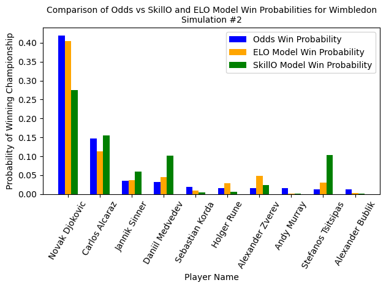

[](https://code.harvard.edu/AM215/final_19/actions/workflows/CI_push.yml)
[](https://code.harvard.edu/AM215/final_19/actions/workflows/docs.yml)


# Predicting Singles Tennis Matches and Tournaments

## Group Members:
Nathan Dennis, John Breedis, Yiming Chen (Team 19)

## Description & Content Overview

In this repository we present a singles tennis match tournament simulation library. There are 2 rating systems used in this project to predict tennis match tournaments including the well known ELO system and the SkillO system developed by us. Tournaments which can be simulated include the Wimbledon, Australian Open, Roland Garros, and US Open, where there are comparable betting odds to compare for the first 3 tournaments listed. Users can freely change parameter combinations in the ELO and SkillO formulas to develop their own predictions for these tournaments. The output of the predictions will be a dataframe corresponding to the predicted probability that a player makes it to a specific round in a tournament, where the last column is the probability they win the Championship.

All tournament simulation data can be found under the src folder. Instructions to run different python scripts are explained below, with deeper explanations regarding specific functions and inputs in the docs folder & related documentation in each python file. The objective of this code is to  simulate major grand slam tournaments and validate these results against betting odds.


### Prerequisites

Ensure you have met these requirements:

- Python 3.8 or higher
- `pip`
- Python libraries:
  - `matplotlib`
  - `numpy`
  - `pandas`
  - `pytest`
  - `requests`
  

## Directory Tree

Here we present the directory tree.

```bash
├── LICENSE
├── README.md
├── requirements.txt
├── .gitignore
├── data
├── imgs
├── docs
│   ├── Makefile
│   ├── make.bat
│   ├── build
│   │   ├── doctrees
│   │   └── html
│   └── source
│       ├── src.rst
│       ├── conf.py
│       ├── index.rst
│       └── modules.rst
├── src
│   ├── Odds_to_Prob.py
│   ├── __init__.py
│   ├── elo_calculations.py
│   ├── error_metrics.py
│   ├── get_tennis_data.py
│   ├── main.py
│   ├── past_matches.py
│   ├── plot.py
│   ├── simulation.py
│   ├── skillo_calculations.py
├── tests
│   ├── test_elo_calculations.py
│   ├── test_error_metrics.py
│   ├── test_get_tennis_data.py
│   ├── test_odds_to_prob.py
│   ├── test_past_matches.py
│   ├── test_plot.py
│   ├── test_simulation.py
│   └── test_skillo_calculations.py
```

## Installation Steps

1. **Clone the Repository**

You can clone our repository to your local machine by running:

```bash
git clone https://code.harvard.edu/AM215/final_19.git
```

2. **Navigate to directory**

Navigate into the project folder

```bash
cd src
```

## Example

We now present an example on how to use our library.

### Load Libraries

You first must open either a python file or python notebook and import all of the libraries you will be using from this project.

```bash
tennis_data = GetTennisData()
plot = Plot()
error = Errors()
elo = ELO(1500, 2023)
skillo = skillO(initial_mean=25, initial_variance=8.3333, current_year=2023, beta = 1, year_decay = 1.1)
odds = Odds()
matches = past_match_data()
```

The ELO class here is initialized with a mean variance of 1500 for all players and the current year being 2023 for the tournaments we will predict. The skillO class is initialized with all players starting with an initial mean rating of 25 and variance of 8.333, with the same current year. The beta value to determine how influential variance is in the predictions is set to 1, and the year decay factor when calculating rating changes from past years data is set to 1.0.

### Obtain tennis Data

Next, we display how to obtain and read the tennis data. Run the following code to get the data, then read it into a csv:

```bash
tennis_data.get_data(year_lower = 2014, year_upper = 2024)
data = pd.read_csv('../data/tennis_data.csv')
```

Now the tennis match history data is read in as 'data'. This gets tennis data between the years 2022 and 2023.

### Create SkillO csv

We first create the SkillO csv file of player ratings and variances. We initialize the skillO class and create a csv file, naming it skillo_1.csv to indicate this is the first simulation.

```bash
skillo.final_csv(data, '../data/skillo_1.csv')
skillo_df = pd.read_csv('../data/skillo_1.csv', index_col = 'Player_Name')
```

We read the SkillO player ratings as skillo_df.

### Create ELO csv

Next, we create the csv for the players ELO ratings given the tennis data. To do this, we simply can call final_elo_csv from the ELO class and just pass in the tennis match data argument. We will not be putting separate simulation numbers on the ELO data.

```bash
elo.final_elo_csv(data)
player_elos = pd.read_csv('../data/player_elos.csv', index_col = 'Player_Name')
```

Now we have that player_elos holds the dataframe of the ELO rating for every player.

### Simulate SkillO Tournament

Next, we can simulate a tennis tournament using the SkillO rating system. We simulate the Wimbledon and run 5000 simulations, averaging the results to obtain the predicted winner probabilities. We first initialize the simulation class given the skillo dataframe, where we set the beta parameter to be equal to 1, similar to the SkillO rating calculation previously. We then run user_tournament_simulation to simulate the given Wimbledon tournament, specifying 5000 simulation runs and the first simulation. We also set saves to be True so the results save to a csv. We can further read the csv created as 'skillo_wimbledon'

```bash
simulation_1 = Simulation(skillo_df, 'skillO', beta = 1)
simulation_1.user_tournament_simulation(data, 2023, 'Wimbledon', 5000, sim_num = '1', saves = True)
skillo_wimbledon = pd.read_csv(f'../data/tournament_results_Wimbledon_skillO_1.csv', index_col = 0)
```

This code will run the simulation and create the csv. Optionally, we read the csv file.

### Simulate ELO Tournament

Next we similate a tournament using the ELO formula. We define simulation but with the player_elos dataframe and specify we want to use the ELO calculation formula. We then simulate the Wimbledon tournament in 2023 and save the result to a csv, reading it as 'ELO_wimbledon'

```bash
simulation_ELO = Simulation(player_elos, 'ELO', S = 800)
simulation_ELO.user_tournament_simulation(data, 2023, 'Wimbledon', 5000, saves = True)
ELO_wimbledon = pd.read_csv(f'../data/tournament_results_Wimbledon_ELO.csv', index_col = 0)
```

### Display Error Metrics

We now display the error metrics for the ELO and SkillO tournament simulations with the displayErrors function from the error class.

```bash
error.displayErrors('SkillO', 'Wimbledon', '1')
```

This displays the error metrics for the SkillO simulation for Wimbledon, with simulation number 1 as we specified earlier.

```bash
error.displayErrors('ELO', 'Wimbledon')
```

This displays the ELO error metrics for the ELO simulation for Wimbledon.

### Make comparison plot to compare SkillO and ELO formulas

We can now display the corresponding bar plot showing the top 10 predicted champions based on the betting odds, with bars representing the predicted champion probabilities for the SkillO and ELO formula.

```bash
plot.plot_ELO_vs_SkillO('Wimbledon', 2023, '1')
```

Here is example output of what this comparison will look like:



We note this is the same second simulation we did in our paper. The results from user simulation may vary, since this code is dependent on randomness in the simulations.

### OPTIONAL, Head-to-head

Users can also simulate tournaments incorporating head-to-head match history into account by incorporating head-to-head parameters in the simulation function:

```bash
simulation_ELO = Simulation(player_elos, 'ELO', S = 800, hth = True, k = 0.1)
```

Here, we set hth, representing head-to-head, to be True, indicating the simulation will incorporate head-to-head match data into analysis. The k factor scales the head-to-head data and the influence on match outcomes.

## Python File Descriptions

In the following section we present descriptions of each python file.

#### get_tennis_data.py

To begin, you can obtain tennis match data between 1960 and 2024 through the `get_tennis_data.py` script under the GetTennisData class, which allows users to input a year interval between 1960 and 2024 to obtain tennis data. This data includes all relevant tournament match outcomes between the years, the winners and losers, their ages, the surface of the tournament, and the tournament level.

#### elo_calculations.py

Next, `elo_calculations.py` contains scripts to calculate ELO scores based on the data given from  `get_tennis_data`. Simply running the "final_elo_csv" function from the ELO class and input the tennis dataframe to output the ELO calculation dataframe for every player in the dataset, saving it to a csv file. Optionally run the function 'win_percentage_common_opponents' in 'past_match_data' to get the win percentage and games played for every player against the others across the dataset, saved in 2 csv files. The input for this function is only the tennis data.

#### skillo_calculations.py

The `skillo_calculations.py` module holds the code to calculate SkillO ratings for all players based on the data given from  `get_tennis_data`. Running the "final_csv" function and inputting the tennis data from `get_tennis_data`, alongside the optimal csv saving path, will allow you to create a SkillO ratings dataframe for each player.

#### simulation.py

To simulate tournaments, initiate the Simulation class with the arguments: rating dataframe for given rating system (ELO or SkillO), rating system as a string ('ELO' or 'skillO'), the S scaling factor (default 400), hth (Boolean value if you want the model to include the head-to-head win percentage data, default False to not include hth), k scaling factor for the head-to-head data (Default 0.1), and the beta value for the skillo rating system (default set to 2). If you are using one rating system, you only need to fill in values if you want for your choice of rating system, like S for ELO and beta for SkillO.Before simulating the tournament, running 'simulation_params' with the win percentage and games played dataframe will include the head-to-head statistics for each player. 

To simulate tournaments, running 'user_tournament_simulation' with the inputs of the tennis data, year, tournament name, number of simulation, simulation number (Default set to 1), and saves (A boolean value to save the resulting simulation results to a csv). This will output a csv file named based on the tournament you are simulating, called  'tournament_results_{self.tournament_name}_{self.rating_system}_{self.simulation_number}.csv depended on the tournament, rating system, and simulation number. If simulation number is none, the last string is left blank. If head-to-head was true, the string '_head_to_head_{k}' with the scaling factor k would be in the csv files name at the end of the tournament name.

#### error_metrics.py

To display error metrics (RMSE, L1, Linf, MAPE, and R-Squared scores), utilize the `Odds_to_prob.py` script and the function "convert_odds" inputting the year and tournament to create a csv file for the given odds based on the year and tournament. Running 'displayErrors' in the `error_metrics.py` script will display the error scores across the given tournament input and simulation number, alongside the optional k scaling factors for the head-to-head data, outputting a dataframe with these values.

#### plot.py

To plot the data, use the `plot.py` script and Plot class. Run the plots function with the input tournament, year, and optional k scaling factors to include head-to-head model data in the plots.

To plot a comparison between the ELO and SkillO predictions, running 'plot_ELO_vs_SkillO' with the tournament name, year, and simulation number will output a png file based on the simulation number for the corresponding SkillO and ELO output.

#### main.py

A working example of this is in the `main.py` script in src. This file runs everything from top to bottom and creates the plot/error metrics for a given tournament. To replicate this, navigate to the source code using 'cd src' in your terminal. Then run 'python main.py' to output the plot image and calculate error metrics.

We note that to fully utilize the plot and errors class, ensure you have the sufficient csv files created to do so when using the head-to-head data. You may need to run simulation multiple times for different head-to-head k factors before plotting and getting the error metrics.

**Test Cases**

To run test cases, you can run: 

```bash
PYTHONPATH=. pytest --cov=src -W ignore::DeprecationWarning -v tests/___.py
```

Where ___ would be the specific testing file you would like to run.

We note based on the github workflows, we have 89% test coverage.

